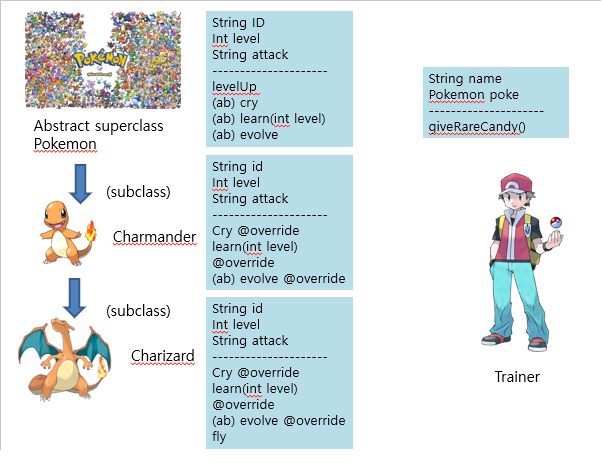

## Homework for Java Programming

# Homework for animal class 

Click [here](https://github.com/minwoo19930301/Homework/tree/master/animal) for the code repository.

```AnimalClassTree

|-------------------------------------------------|
|Animal(abstract)                                 |                                     
|-------------------------------------------------|
|Canine(abstract)      |  Feline(abstract)        |
|-------------------------------------------------|
|Dog                   |  Cat                     |
|-------------------------------------------------|


+updated Pet interface and Robot-RobotDog class tree
```

# Pokemon class
### introduction of downcasting and cloning

Click [here](https://github.com/minwoo19930301/Homework/tree/master/pokemonJava). 

# Gui Practice
Click [here](https://github.com/minwoo19930301/Homework/tree/master/gui). 

# Calculator Project Code
Click [here](https://github.com/minwoo19930301/Homework/tree/master/calculator).

# Calculator Project Code - OOP style upgraded
Click [here](https://github.com/minwoo19930301/Homework/tree/master/oopCalculator).

